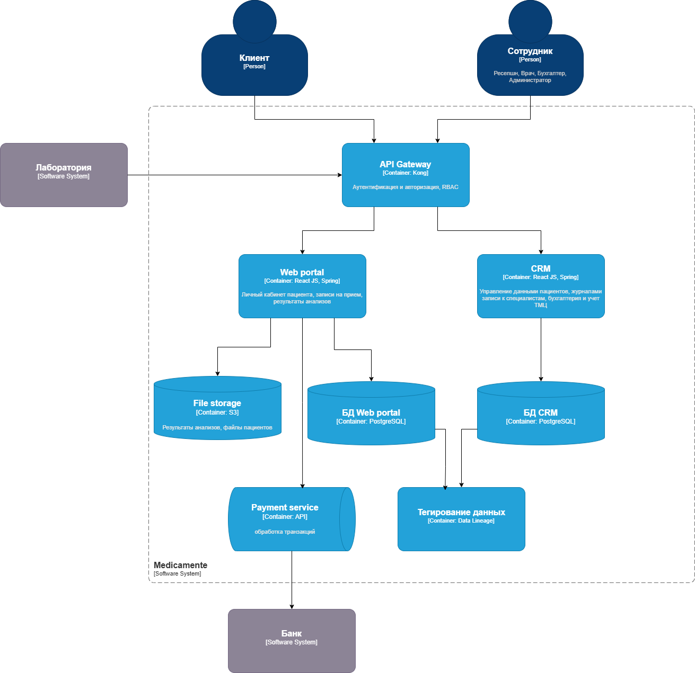

# Задание 2

В этом задании вам нужно предложить решение To-Be, которое решит проблемы, выявленные на прошлом этапе, и будет отвечать потребностям бизнеса. В ходе работы ориентируйтесь на требования из блока «Цели компании». Учитывайте как функциональные, так и нефункциональные требования к системе.

## Что нужно сделать

Спроектируйте решение To-Be для MVP. Подготовьте диаграмму контейнеров в модели C4. Отобразите на ней свои предложения по усилению Data Privacy — как системы должны работать с конфиденциальными данными.

Опишите в блоках комментариев:
- как данные хранятся,
- периоды и условия уничтожения конфиденциальных данных после обработки,
- какие способы защиты данных используются при хранении и передаче данных.

# Решение

[C4 model schema](./c4-model.drawio)

1. Web portal
    - Функционал: личный кабинет клиентов, просмотр результатов анализов, запись к специалистам
    - Хранение данных: Hadoop или любая другая СУБД с шифрованием, например PostgreSQL.
    - Передача данных: защищённые каналы (TLS 1.3), API Gateway с аутентификацией.
    - Срок хранения: данные удаляются через 1 год после завершения услуг или по запросу клиента.
    - Защита данных: шифрование. Тегирование чувствительных данных (PII, Medical).

2. CRM 
    - Функционал: портал для сотрудников: управление данными пациентов, управление журналами записи к специалистам, бухгалтерия, учет ТМЦ и т.д. 
    - Хранение данных: СУБД с шифрованием данных, например PostgreSQL.
    - Передача данных: защищённый API Gateway с аутентификацией.
    - Сроки хранения: финансовые данные — 5 лет, записи клиентов — 1 год.
    - Защита данных: ролевой доступ (RBAC), шифрование данных на уровне БД.

3. Платёжный сервис
    - Функционал: обработка транзакций.
    - Хранение данных: не хранит данные платежных данных
    - Передача данных: взаимодействие через API
